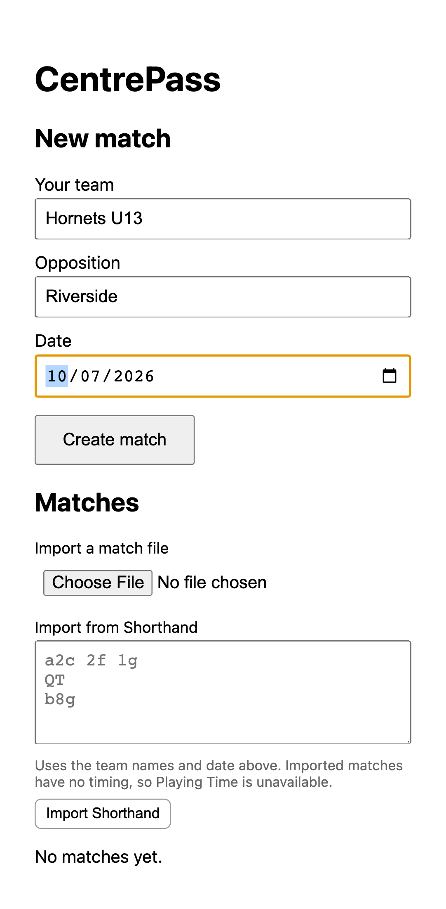
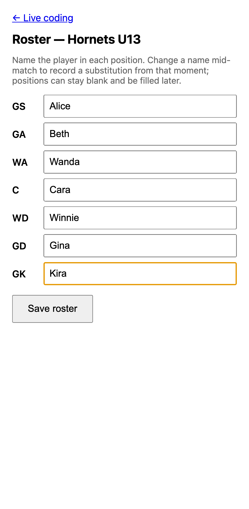
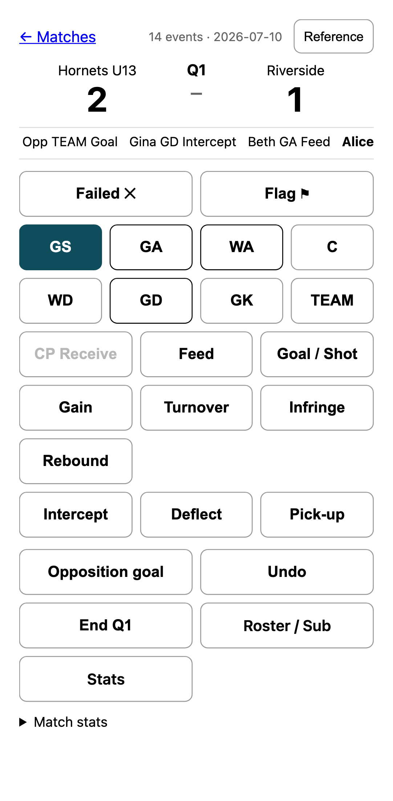
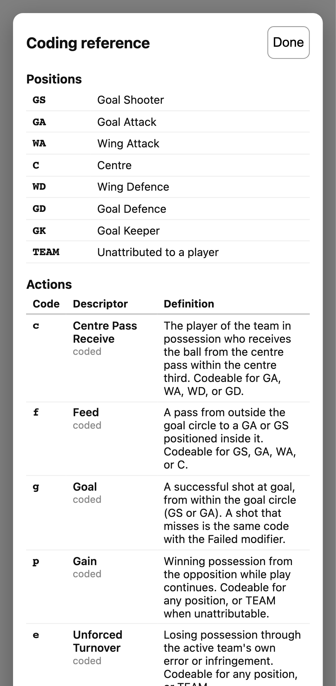
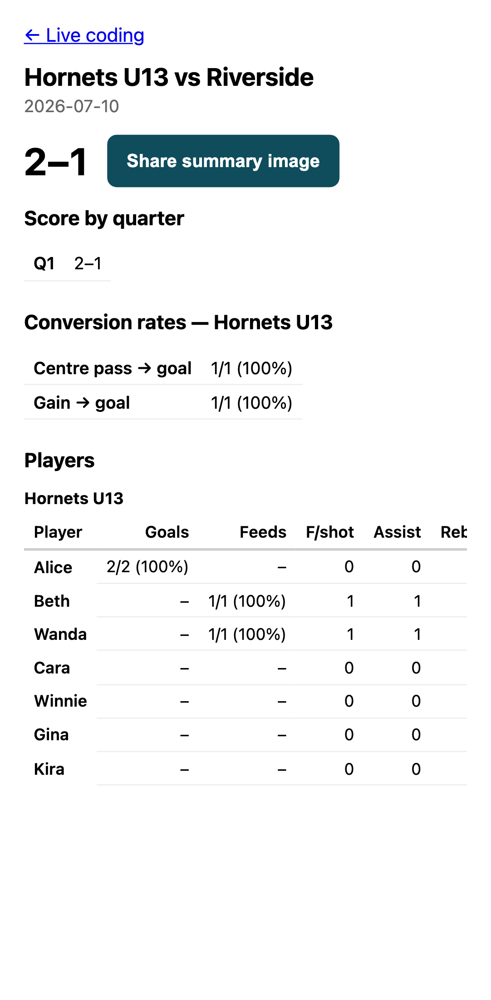

# CentrePass quickstart

A five-minute guide to coding your first match. CentrePass runs entirely on your
phone — no account, no install, works with no signal at the courtside.

## Open it and keep it

Open the app link in your phone's browser, then **Add to Home Screen**. It now
launches like any app and works fully offline. Everything you record is stored
on your device.

## 1. Create the match

Tap **New match**, enter your team, the opposition, and the date.

## 2. Enter your roster

Put a player's name (or number) against each position. You can substitute
players later from the **Roster / Sub** button during the match; playing time is
worked out from when each change happens.

## 3. Code the match

This is the screen you'll use courtside. To record something a player did:

1. Tap the **position** (GS, GA, … or TEAM if you can't attribute it).
2. Tap the **action** (Goal / Shot, Feed, Gain, …).

That's two taps per event. A few extras:

- **Failed ✕** — arm this first for a missed shot or an incomplete feed, then
  tap the action. It clears after one event.
- **Flag ⚑** — mark an event to review later.
- **Opposition goal** — one tap adds a goal for the other team to the scoreboard.
- **Undo** — removes the last thing you recorded.
- **End Q1 / Q2 / Q3** — marks the end of each quarter (the fourth is full time).
- **Reference** — a reminder of every position, action, and modifier, without
  losing your place.

The strip under the score shows your last few events so you can spot-check.

Not sure what a code means? Tap **Reference** any time — it opens over the
coding screen and closes straight back to it, exactly where you were.

## 4. Read the stats

Tap **Stats** for the full picture: the final score and per-quarter scores,
each player's goals, feeds, assists, rebounds, turnovers and gains, and the
team's centre-pass and gain conversion rates. Everything is derived from what
you coded — nothing is entered twice.

## 5. Share it

- **Share summary image** on the stats screen makes a picture of the headline
  numbers, ready to drop into the club chat.
- **Export** (on the match list) saves the whole match as a file you can back up
  or send to another device, where **Import** brings it back in exactly.

## Faster input: Shorthand

If you're a quick typist you can paste a whole match as compact text instead of
tapping. See the [Shorthand reference](shorthand.md). Tap coding and Shorthand
produce the very same event log.
