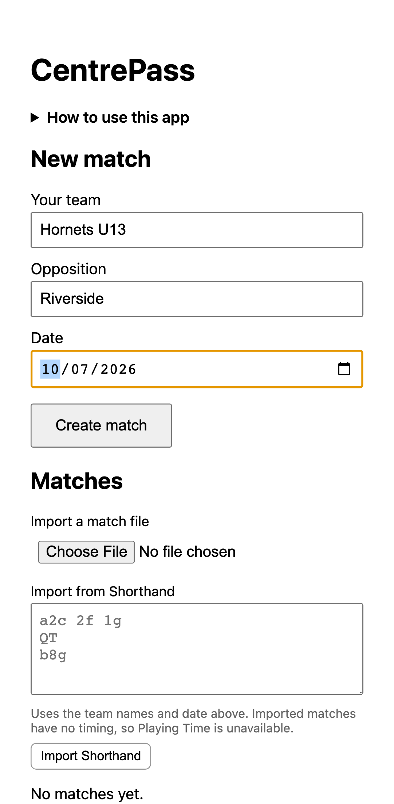
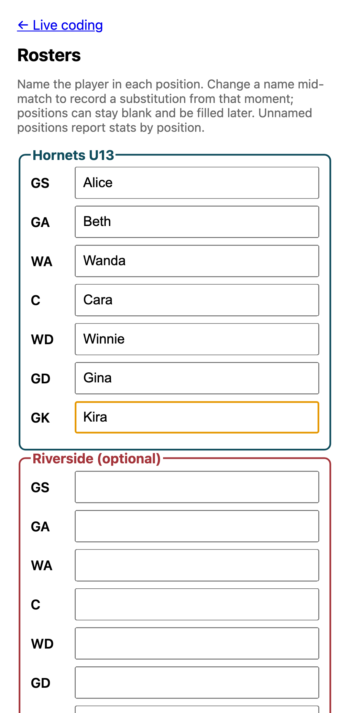
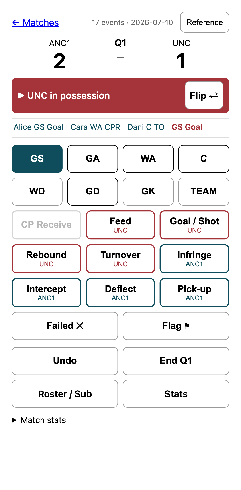
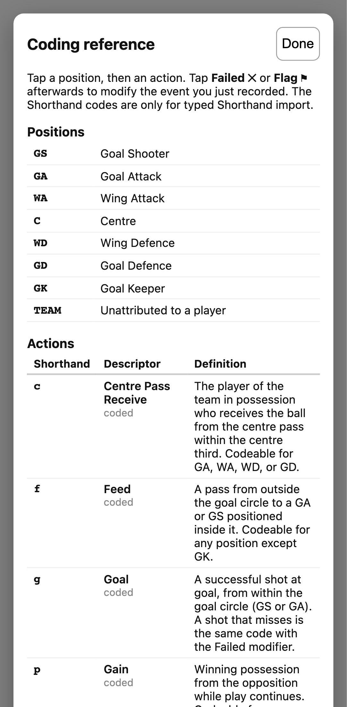
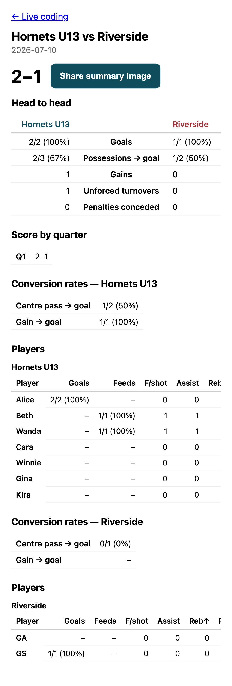

# CentrePass quickstart

A five-minute guide to coding your first match. CentrePass runs entirely on your
phone — no account, no install, works with no signal at the courtside.

## Open it and keep it

Open the app link in your phone's browser, then **Add to Home Screen**. It now
launches like any app and works fully offline. Everything you record is stored
in that browser on your device — a different browser (or the home-screen app
versus the browser tab) has its own separate list. Use **Export** / **Import**
to move matches between them.

## 1. Create the match

Tap **New match**, enter both teams' names and the date.

## 2. Enter your roster

Put a player's name (or number) against each position. The other team's roster
is optional — any position left blank reports its stats under the position
(GS, GA, …). You can substitute players later from the **Roster / Sub** button during the match; playing time is
worked out from when each change happens.

## 3. Code the match

This is the screen you'll use courtside. You code **both teams**, and the app
keeps track of who has the ball: the banner under the score says which team is
in possession, and every action button names (and is outlined in the colour of)
the team a tap will be recorded for.

At the first centre pass the banner asks **who has the centre pass** — pick the
team that won the toss. After that, possession follows the play: a turnover
hands the ball over, a **Gain** or an **Infringement** is always by the team
*without* the ball, a GD/GK **Rebound** belongs to the defenders, and after each
goal (and each quarter) the centre pass alternates. If the app ever has it
wrong, tap **Flip ⇄** — it swaps the team for your next tap only.

To record something a player did:

1. Tap the **position** (GS, GA, … or TEAM if you can't attribute it).
2. Tap the **action** (Goal / Shot, Feed, Gain, …).

That's two taps per event. A few extras:

- **Failed ✕** — tap straight after the action for a missed shot or an
  incomplete feed (e.g. GA → Goal / Shot → Failed ✕). Tap again to undo it.
- **Flag ⚑** — tap straight after an event to mark it for review later.

Failed and Flag always apply to the last event you recorded.
- **Undo** — removes the last thing you recorded.
- **End Q1 / Q2 / Q3** — marks the end of each quarter (the fourth is full time).
- **Reference** — a reminder of every position, action, and modifier, without
  losing your place.

The strip under the score shows your last few events, each in its team's
colour, so you can spot-check.

Not sure what a code means? Tap **Reference** any time — it opens over the
coding screen and closes straight back to it, exactly where you were.

## 4. Read the stats

Tap **Stats** for the full picture: a head-to-head of both teams (shooting,
possessions converted, gains, turnovers, penalties), the final score and
per-quarter scores, each player's goals, feeds, assists, rebounds, turnovers and gains, and the
team's centre-pass and gain conversion rates. Everything is derived from what
you coded — nothing is entered twice.

## 5. Share it

- **Share summary image** on the stats screen makes a picture of the headline
  numbers, ready to drop into the club chat.
- **Send match file** (on the stats screen, where tapping **Full time** takes
  you) sends the whole match as a file. Send it to your club's chat or shared
  folder. It's your backup, and it's how the club collects every match.
  **Export** on the match list does the same. A match marked **Not sent** on
  the list has changes the club hasn't had yet.
- **Import** brings a match file back in exactly. If you already have that
  match (say, a corrected copy was re-sent), you're asked before your copy is
  replaced.

## Faster input: Shorthand

If you're a quick typist you can paste a whole match as compact text instead of
tapping. See the [Shorthand reference](shorthand.md). Tap coding and Shorthand
produce the very same event log.
