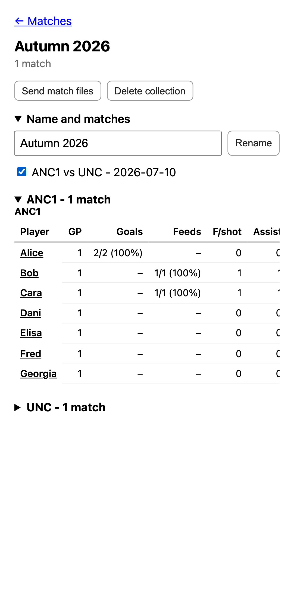

# CentrePass quickstart

This is a five-minute guide to coding your first match.

## Put it on your home screen

Open https://louispt1.github.io/centrepass/ in Safari (iPhone) or Chrome
(Android), then **Share → Add to Home Screen** (Chrome: **⋮ → Add to Home
screen**). It then opens like any other app and works fully offline.

Note: your matches live only in that browser on that phone.
Back up your match files somewhere safe (see [Share it](#5-share-it))
so a cleared browser doesn't mean you lose all your data.

## 1. Create the match

Under **New match**, enter both team names and the date, then tap **Create match**.
Entering names consistently will let you aggregate stats under that team.

## 2. Enter your roster

Put a name under each position. It's optional, but it's what lets
a [collection](#6-collections-season-stats) add up each player's stats across
matches, so spell names the same way every week. Subs happen mid-match from
**Roster / Sub**, and playing time is worked based on when you enter the sub.

## 3. Code the match

You code **both teams**, and the app keeps track of who has the ball. The
banner under the score shows who's in possession, and each action button is
labelled (and outlined) with the team an input will count for.

At the first centre pass, pick the team that won the toss. From there
possession follows the play: turnovers hand the ball over, centre passes
alternate after goals and quarters, and so on. If it ever gets it wrong, tap
**Flip ⇄**, which swaps the team for your next tap only.

Every event is two taps:

1. The **position** (GS, GA, … or TEAM if you're not sure).
2. The **action** (Goal / Shot, Feed, Intercept, …).

Then, if needed, straight after:

- **Failed ✕** for a missed shot or a feed that didn't land. Tap again to undo.
- **Flag ⚑** to mark the event to check later.
- **Undo** removes the last thing you recorded.
- **End Q1 / Q2 / Q3** marks the end of each quarter.

The strip under the score shows your last few events in team colours, so you
can spot a mistake and undo.

**Reference** opens over the coding screen and closes straight back to it, outlining
the definitions of each action.

## 4. Read the stats

Tap **Stats** for the full picture: head-to-head, score by quarter, conversion
rates, and a line for every player. It's all worked out from what you coded.

## 5. Share it

- **Share summary image** makes a picture of the headline numbers.
- **Send match file** sends the whole match. It's your backup, and how you can centralise matches coded by different people.
  **Export** on the match list does the same, and a match marked **Not sent**
  has changes that aren't backed up yet.
- **Import** brings a match file back in. If you already have that match
  (say, someone sent a corrected copy), you're asked before yours is replaced.

## 6. Collections (season stats)

A collection groups matches, like a season or a tournament, and adds up each
player's stats across them, with games played.

On the home screen, type a name under **Collections** and tap **Create**. Open
it, tap **Name and matches**, and tick the matches to include. You can also add
a match from the match list via its **Collections** button.

If a player's name was spelled two ways ("Ali" and "Alice"), tap the name in
the table and merge it into the right one. Only the collection's totals change;
the matches themselves stay as coded.

Collections live on your phone only. To share a season, **Send match files**
sends every match in the collection; whoever receives them imports the matches and builds
their own collection.

## Faster input: Shorthand

Quick typist? You can paste a whole match as compact text instead of tapping.
See the [Shorthand reference](shorthand.md); it produces exactly the same match
as tap coding.

Found a bug or got an idea? I'd love to hear it.
